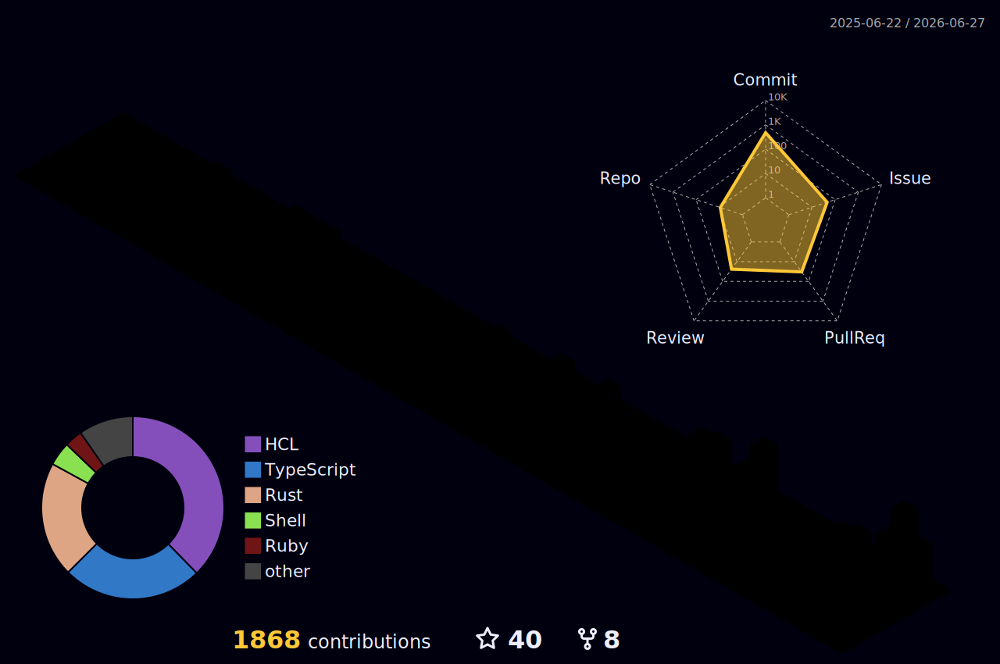

<em>Infrastructure Engineer · Platform Engineering · SRE</em>

 

---

Most of my work lives in private repositories — production infrastructure, internal platforms, systems built for scale. 
I design and operate cloud-native platforms, build automation that removes humans from the loop, 
and wire observability and security into the fabric of infrastructure across bare-metal and multi-cloud environments.

---

## Stack

 

**Platforms & Orchestration**

**Observability**

**Networking & Security**

---

## Activity

  
  

  

  

---

## Connect

  
  
  

---

  Most systems I run you'll never see — that's the point.

